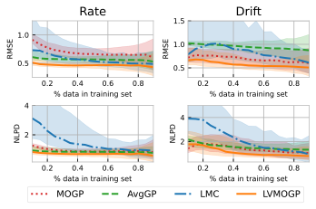
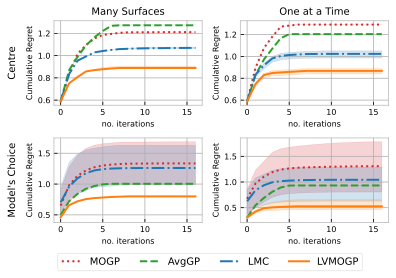
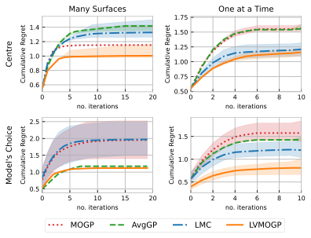

# Transfer Learning Design of Experiments for DNA Optimisation

This repository contains the code for the DNA amplification experiments conducted for the paper
_Transfer Learning Bayesian Optimization to Design Competitor DNA Molecules for Use in 
Diagnostic Assays_ [1].

## Installation

To clone this repo use the command:
    
     git clone https://github.com/RSedgwick/TL_DOE_4_DNA.git

The code is written in Python 3.9. To install the required packages, ensure conda is installed and run the following 
command in the root directory of the project:

     conda env create -f environment.yml 

You also need to initialise the candas package by running the following command in candas directory:
    
     pip install -e ./

## Overview 

In this project, we propose a transfer learning Bayesian optimization method for competitor DNA molecule development. We
compare the performance of different transfer learning Gaussian processes within this framework. The models we compare are:
the multioutput Gaussian process (MOGP), an average GP (AvgGP), the linear model of coregionalisation (LMC) and
the latent variable multioutput Gaussian process (LVMOGP) [2]. We use cross-validation to compare the predictive accuracy 
of the different models and then compare their performance in a sequential Bayesian optimisation setting.

For each competitor DNA molecule we want the rate `r` to be as close to the target rate as possible and for the 
drift `m` to lie below a threshold value. Our inputs are the number of base pairs `BP` and the % guanine-cytosine 
content `GC`. We use an adapted expected improvement acquisition function to minimise the difference between 
the rate and target rate [3] and penalise drifts above a given threshold.

## Data 
The data used in this project was collected from the DNA amplification experiments conducted in the lab. The 
target variables were calculated in advance. See the paper for more details.

## Results

Results of the cross-validation experiments appear in Figure 5 of Sedgwick et al. [1]:



Results of the unconstrained Bayesian optimisation experiments appear in Figure 6 of Sedgwick et al. [1]:



Results of the constrained Bayesian optimisation experiments appear in Figure 6 of Sedgwick et al. [1]:




## Code Overview

- `analysis` - contains the code for the analysis of the results
    - `plots` - contains the plots of the results
    - `constrained_retrospective_bayesian_optimisation_results.ipynb` - analysis of the constrained optimisation results
    - `cross_validation_results.ipynb` - analysis of the cross-validation results
    - `data_summary.ipynb` - summary of the DNA amplification data
    - `get_best_points.ipynb` - finds the best points on each of the surfaces to be used in calculating regret
    - `mystyles.mplstyle` - matplotlib style sheet
    - `plotting_scripts.py` - functions for plotting the results
    - `retroBO_analysis_functions.py` - functions for analysing the results of the Bayesian optimisation experiments
    - `surface_plots_constrained.ipynb`- notebook for plotting surfaces and expected improvements from Bayesian optimisation
    - `unconstrained_retrospective_bayesian_optimisation_results.ipynb` - analysis of the unconstrained optimisation results
- `candas` - package created for analysis of DNA amplification experiments
  - `learn` - contains the code for the Gaussian process models
  - `plotting` - contains the code for plotting 
  - `utils` - contains utility functions
  - `style` - contains the matplotlib style sheet
- `data` - contains the data used in the experiments
  - `ADVI_ParameterSets_220528.pkl` - the results of the DNA amplification experiments
  - `best_df.pkl` - dataframe of the best points on each of the surfaces not taking constraint into account
  - `best_df_penalised.pkl` - dataframe of the best points on each of the surfaces taking the drift penalty into account
  - `JG067 sequence targets.csv` - the target values for the rates 
- `experiments` - contains the code for the experiments
  - `expected_improvements.py` - contains the expected improvement acquisition functions for both single objective and with the drift penalty 
  - `retro_BO.py` - contains a class for running Bayesian optimisation experiments
    - `retro_BO_run.py` - runs the Bayesian optimisation experiments
  - `test_case_setup.py` - contains the functions for setting up the test cases e.g. starting point etc
  - `x_validation_for_retroBO.py` - runs the cross-validation experiments
  - `x_validation_functions.py` - contains the functions for running the cross-validation results
- `results` - contains the results of the cross-validation and Bayesian optimisation experiments
- `tests` - code tests

## References 

[1] [Ruby Sedgwick, John Goertz, Molly Stevens, Ruth Misener and Mark van der Wilk. "Transfer Learning Bayesian Optimization to Design Competitor DNA Molecules for Use in Diagnostic Assays" (2024).](https://analyticalsciencejournals.onlinelibrary.wiley.com/doi/10.1002/bit.28854)

[2] [Zhenwen Dai, Mauricio Álvarez, and Neil Lawrence. "Efficient modeling of latent information in supervised learning using gaussian processes." Advances in Neural Information Processing Systems 30 (2017).](https://arxiv.org/abs/1705.09862)

[3] [Uhrenholt, A. K. and Jensen, B. S. (2019) Efficient Bayesian Optimization for Target Vector Estimation. In Proceedings of the Twenty-Second International Conference on Artificial Intelligence and Statistics (eds. K. Chaudhuri and M. Sugiyama), vol. 89 of Proceedings of Machine Learning Research](http://proceedings.mlr.press/v89/uhrenholt19a/uhrenholt19a.pdf)

## How to Cite 
When using the code in this repository, please reference our paper as:
```
@article{sedgwick_transfer_2023,
  title={Transfer Learning Bayesian Optimization for Competitor DNA Molecule Design for Use in Diagnostic Assays},
  author={Sedgwick, Ruby and Goertz, John and Stevens, Molly and Misener, Ruth and van der Wilk, Mark},
  journal={},
  volume={},
  pages={},
  year={},
  publisher={}
}
```
## Acknowledgements
This work was supported by the [UKRI CDT in AI for Healthcare](https://ai4health.io/) Grant No. EP/S023283/1 

